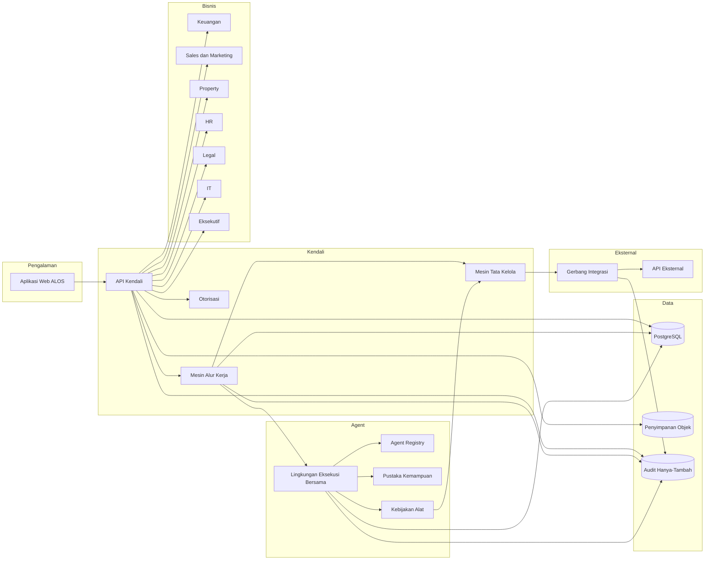
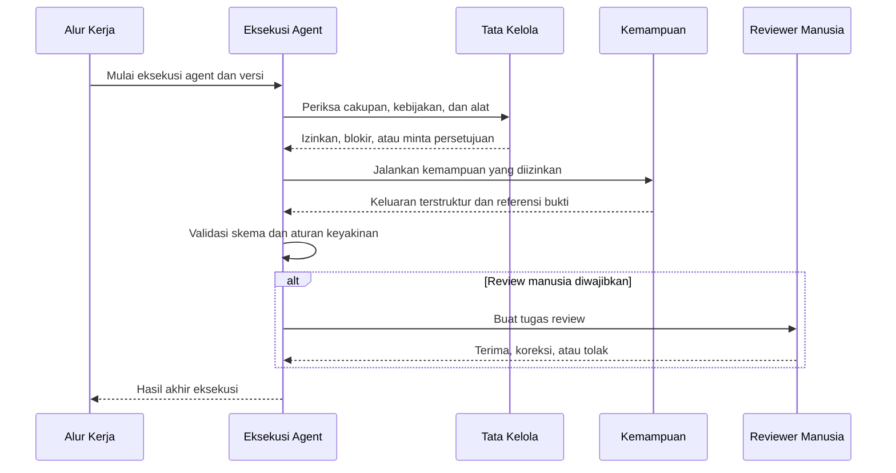

# Arsitektur ALOS Internal v1

| Metadata | Nilai |
|---|---|
| Status | Rancangan untuk Pilot Internal |
| Versi | 0.1.0 |
| Gaya arsitektur | Monolit modular dengan lingkungan eksekusi agent bersama |
| Pembaruan terakhir | 28 Agustus 2026 |

## 1. Tujuan dan Cakupan

Dokumen ini menetapkan arsitektur logis dan deployment ALOS Internal v1. Rancangan pilot mempertahankan batas modul yang tegas agar sistem dapat berkembang tanpa memperkenalkan microservice, database, atau aplikasi terpisah sebelum terdapat kebutuhan terukur.

## 2. Keputusan Arsitektur

- satu monorepo privat pada GitHub Organization;
- satu aplikasi web internal;
- satu basis kode backend modular yang dapat dijalankan sebagai API, worker, dan scheduler;
- satu PostgreSQL dengan skema logis dan kepemilikan modul;
- satu penyimpanan objek untuk dokumen dan bukti;
- satu lingkungan eksekusi untuk 18 Core Agent logis;
- aturan tata kelola dan alur kerja deterministik berada di luar prompt;
- sistem eksternal hanya diakses melalui adaptor integrasi terkendali;
- Genesis dipisahkan dari operasi harian dan perubahan produksi.

## 3. Arsitektur Logis



## 4. Tanggung Jawab Komponen

| Komponen | Tanggung jawab | Larangan utama |
|---|---|---|
| Aplikasi Web | ruang kerja berbasis peran, formulir, antrean, review, dan dasbor | menyimpan aturan bisnis resmi |
| API Kendali | konteks identitas, perintah, kueri, dan batas transaksi | melewati aturan domain atau tata kelola |
| Modul Domain | invariant bisnis, kepemilikan, dan perubahan status | memanggil vendor secara langsung |
| Mesin Alur Kerja | status tahan gangguan, langkah, timer, percobaan ulang, dan kompensasi | memakai LLM untuk menentukan transisi |
| Mesin Tata Kelola | akses, bukti, persetujuan, SoD, dan evaluasi kebijakan | menyetujui atas nama manusia |
| Agent Registry | definisi yang dirilis, versi, status, dan kemampuan yang diizinkan | menyimpan rahasia atau akses bebas |
| Lingkungan Eksekusi Agent | menjalankan kemampuan sah dan memvalidasi keluaran | menjalankan kode atau jaringan bebas |
| Gerbang Integrasi | kontrak alat netral vendor, kredensial, idempotensi, dan percobaan ulang | membuka kredensial kepada agent |
| Modul Eksekutif | model baca resmi, KPI, ringkasan, dan antrean keputusan | menyamakan inferensi AI dengan fakta terverifikasi |
| Genesis | menyusun usulan, validasi, uji, selisih, review, dan rilis definisi | mengubah produksi atau organisasi langsung |
| Audit | riwayat tindakan material dan asal-usul data | menjadi tabel operasional yang dapat diedit |

## 5. Batas Modul Backend

Setiap modul mengikuti empat lapisan:

```text
antarmuka      penangan HTTP/kejadian dan skema masukan-keluaran
aplikasi       kasus penggunaan dan orkestrasi
domain         entitas, invariant, kebijakan, perintah, dan kejadian
infrastruktur  repository database dan implementasi adaptor
```

Arah ketergantungan yang diizinkan adalah `antarmuka -> aplikasi -> domain`. Infrastruktur mengimplementasikan antarmuka yang dimiliki lapisan aplikasi atau domain. Perubahan lintas domain menggunakan perintah atau kejadian kanonik, bukan penulisan langsung ke tabel domain lain.

## 6. Perintah, Kueri, dan Kejadian

- **Perintah** meminta perubahan status serta membawa aktor, peran aktif, proyek, kunci idempotensi, dan ID korelasi.
- **Kueri** membaca tampilan yang sudah diotorisasi dan tidak boleh mengubah status bisnis.
- **Kejadian** menyatakan fakta yang telah diterima setelah transaksi berhasil disimpan.

Amplop kejadian minimum:

| Bidang | Ketentuan |
|---|---|
| `event_id` | pengenal unik global |
| `event_type` | nama stabil dan memiliki ruang nama |
| `version` | versi skema kejadian |
| `entity_type`, `entity_id` | entitas yang terdampak |
| `project_id` | cakupan proyek jika berlaku |
| `occurred_at` | waktu UTC |
| `actor` | identitas manusia, layanan, atau agent |
| `correlation_id` | korelasi operasi ujung-ke-ujung |
| `causation_id` | perintah atau kejadian pemicu |
| `payload` | data kejadian yang diberi versi |

Kejadian diterbitkan melalui pola transactional outbox agar perubahan database dan publikasi kejadian tidak berbeda keadaan.

## 7. Ketahanan Alur Kerja

Pilot menggunakan status alur kerja berbasis PostgreSQL dan worker. Setiap langkah mencatat versi alur, syarat transisi, jumlah percobaan, batas waktu, jadwal percobaan berikutnya, referensi masukan-keluaran, agent atau aktor, bukti, persetujuan, penyimpangan, korelasi, dan audit.

Pekerjaan jangka panjang harus dapat dilanjutkan setelah proses dimulai ulang. Perintah duplikat ditolak atau mengembalikan hasil sebelumnya melalui kunci idempotensi.

## 8. Lingkungan Eksekusi Agent Bersama

Lingkungan eksekusi mengambil definisi agent yang telah dirilis, memeriksa izin, memvalidasi masukan, dan menjalankan kemampuan terdaftar. Kemampuan dapat digunakan bersama oleh beberapa agent; nama agent tidak membentuk service baru.



Agent tidak memperoleh akses bebas ke database, sistem berkas, shell, jaringan, atau kredensial.

## 9. Data dan Penyimpanan

- PostgreSQL menjadi sistem pencatatan operasional utama.
- Berkas dokumen dan bukti disimpan di penyimpanan objek; database menyimpan metadata, hash, klasifikasi, versi, dan relasi.
- Redis dapat ditambahkan untuk cache atau kunci jangka pendek, tetapi tidak menjadi sumber data resmi.
- Model baca analitik diturunkan dari data operasional dan kejadian.
- Indeks vektor, jika digunakan, hanya merupakan turunan dan tidak menggantikan dokumen kanonik.
- audit hanya-tambah dipisahkan dari data aplikasi yang dapat diperbarui.

## 10. Arsitektur Integrasi

Modul domain menggunakan kontrak netral vendor, misalnya pembaca transaksi bank, gerbang lead CRM, penyimpanan dokumen, atau pengirim notifikasi. Implementasi vendor ditempatkan di balik Gerbang Integrasi.

Setiap panggilan eksternal mencatat versi konektor dan operasi, referensi kredensial terbatas, aktor, konteks izin, kunci idempotensi, timeout, percobaan ulang, metadata hasil yang telah dimasking, ID korelasi, dan referensi audit. Tindakan penulisan material memerlukan hasil kebijakan yang sah serta token tindakan dari persetujuan bila diwajibkan.

## 11. Topologi Deployment

| Proses | Peran |
|---|---|
| `web` | antarmuka web tanpa status permanen |
| `api` | API tanpa status permanen |
| `worker` | pekerjaan alur kerja dan agent di latar belakang |
| `scheduler` | pengingat, tenggat, dan timer terjadwal |
| `postgres` | database tahan lama |
| `object-storage` | penyimpanan dokumen dan bukti |
| `identity` | penyedia identitas lokal kompatibel OIDC jika dipilih |
| `telemetry-collector` | saluran log, metrik, dan trace |

Docker Compose menjadi dasar lokal dan pengujian yang dapat diulang. Hosting produksi tetap `TBD`.

## 12. Kriteria Pemisahan Service

Modul hanya dipisahkan menjadi service mandiri apabila terdapat bukti kebutuhan berupa skala komputasi berbeda, isolasi keamanan, target ketersediaan mandiri, batas sistem eksternal, tim dan siklus rilis independen, atau masalah latensi/deployment yang terukur. Delapan belas Core Agent bukan batas service.

## 13. Observabilitas

Log, metrik, dan trace membawa ID korelasi yang sama dari pengguna, API, alur kerja, agent, kemampuan, alat, integrasi, perubahan data, hingga audit. Sinyal minimum meliputi kesehatan alur, keberhasilan agent, usia persetujuan, usia penyimpangan/CAPA, blokir kebijakan, kesehatan integrasi, versi model, latensi, biaya, kesalahan alat, dan tingkat koreksi manusia.

## 14. Keputusan Terbuka

- hosting produksi, RTO, RPO, dan SLO: `TBD`;
- penyedia identitas final: `TBD`;
- penyedia dan bentuk deployment LLM: `TBD`;
- teknologi alur kerja di luar pilot PostgreSQL: diputuskan berdasarkan hasil pengukuran;
- adaptor vendor produksi: hanya diaktifkan setelah kontrak, kredensial, review keamanan, dan UAT.
