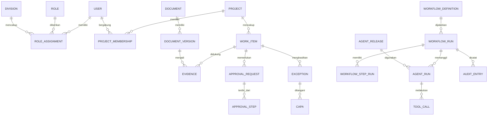

# Model Domain dan Database ALOS Internal v1

| Metadata | Nilai |
|---|---|
| Status | Rancangan untuk Pilot Internal |
| Versi | 0.1.0 |
| Cakupan | Model domain dan rancangan logis database |
| Pembaruan terakhir | 28 Agustus 2026 |

## 1. Tujuan

Dokumen ini menetapkan bahasa domain bersama, batas kepemilikan data, entitas inti, hubungan, dan aturan penyimpanan ALOS Internal v1. Rancangan ini menjadi dasar migrasi database dan kontrak antar-modul, bukan kamus data bisnis final perusahaan.

## 2. Prinsip Model Data

1. Satu fakta memiliki satu pemilik resmi dan satu sumber yang dapat ditelusuri.
2. Identitas kanonik dipakai lintas divisi; atribut tetap dimiliki domain terkait.
3. Perubahan material dilakukan melalui perintah dan invariant domain, bukan pembaruan tabel bebas.
4. Riwayat audit bersifat hanya-tambah.
5. Dokumen dan bukti memiliki versi, hash, klasifikasi, dan asal-usul.
6. Status operasional dan hasil analisis AI dibedakan secara eksplisit.
7. Data setiap pekerjaan dibatasi oleh organisasi, divisi, proyek, peran aktif, dan tujuan penggunaan.
8. Penghapusan mengikuti retensi yang disahkan; nilai retensi awal berstatus `TBD`.

## 3. Agregat Inti

| Agregat | Tanggung jawab | Contoh entitas |
|---|---|---|
| Identitas dan Organisasi | identitas manusia serta konteks kewenangannya | User, Role, Division, RoleAssignment |
| Proyek | batas operasional dan akses berbasis proyek | Project, ProjectMembership |
| Pekerjaan | antrean kerja dan tanggung jawab | WorkItem, Assignment, Deadline, Reminder |
| Dokumen dan Bukti | berkas, versi, metadata, dan validasi | Document, DocumentVersion, Evidence, EvidenceCheck |
| Tata Kelola | kebijakan, persetujuan, SoD, penyimpangan | Policy, ApprovalRequest, ApprovalStep, Exception, CAPA |
| Alur Kerja | definisi dan eksekusi tahan gangguan | WorkflowDefinition, WorkflowRun, WorkflowStepRun, Timer |
| Agent | definisi berversi dan catatan eksekusi | AgentDefinition, AgentRelease, AgentRun, ToolCall |
| Eksekutif | KPI, ringkasan, dan antrean keputusan | KPISnapshot, ExecutiveBrief, DecisionItem |
| Integrasi | konektor dan pertukaran data eksternal | Connector, ExternalReference, InboxMessage, OutboxEvent |
| Audit | jejak tindakan dan integritas | AuditEntry, AuditChainCheckpoint |

## 4. Model Hubungan Tingkat Tinggi

## 5. Entitas Platform

### 5.1 Identitas dan kewenangan

- `User` merepresentasikan satu identitas manusia; akun bersama dilarang.
- `Role` mendefinisikan sekumpulan izin, bukan identitas orang.
- `RoleAssignment` menghubungkan pengguna dengan peran, divisi, masa berlaku, dan batas proyek.
- `ProjectMembership` menetapkan akses pengguna pada proyek.
- peran aktif wajib dinyatakan pada tindakan material agar rangkap jabatan tetap dapat diaudit.

### 5.2 Pekerjaan

`WorkItem` menjadi unit kerja universal dengan pemilik, divisi, proyek, prioritas, status, tenggat, asal, dan referensi alur kerja. Penugasan ulang, perubahan tenggat, dan penutupan wajib menghasilkan kejadian dan audit.

`WorkItemAssignment` menyimpan riwayat claim, assignment, delegasi, dan release beserta
aktor, owner sebelum/sesudah, alasan, dan waktu. `Reminder` mengacu pada work item atau
approval, penerima pengguna/divisi, jenis `DUE_SOON`, `OVERDUE`, atau `ESCALATION`, level,
serta status pengiriman. Evaluasi deadline bersifat deterministik, idempotent pada level
yang sama, dan berhenti pada level maksimum yang dikonfigurasi dalam schema.

Siklus umum:

`DRAFT -> OPEN -> IN_PROGRESS -> NEEDS_REVIEW -> PENDING_APPROVAL -> COMPLETED`

Status tambahan: `BLOCKED`, `CANCELLED`, dan `FAILED`. Transisi ditentukan definisi alur kerja, bukan teks bebas.

### 5.3 Dokumen dan bukti

`Document` adalah identitas logis dokumen dengan pemilik organisasi, divisi bisnis, dan konteks proyek opsional. `DocumentVersion` bersifat immutable serta menyimpan referensi objek internal, nama berkas asal, hash, tipe media, ukuran, provider, versi, status scan, dan status verifikasi. Klasifikasi melekat pada identitas dokumen. `Evidence` menghubungkan versi tertentu dengan klaim/tahap tertentu. Bukti tidak dianggap sah hanya karena berhasil diunggah atau dipindai.

Isi berkas tidak disimpan di PostgreSQL. Upload membuat object key dari UUID internal,
sedangkan API menghitung hash dan ukuran tanpa mempercayai metadata klien. Versi tidak
ditimpa; hash yang sama pada dokumen yang sama ditolak. Akses isi selalu diperiksa ulang
berdasarkan organisasi, divisi, proyek, klasifikasi, dan peran.

## 6. Tata Kelola

### 6.1 Persetujuan

`ApprovalRequest` menyimpan subjek, pemohon, peran pemohon, kebijakan dan versi yang digunakan, tingkat risiko, bukti, serta status. `ApprovalStep` menyimpan calon penyetuju, urutan atau paralelisme, keputusan, alasan, dan waktu.

Invariant minimum:

- identitas pemohon tidak boleh menyetujui pekerjaannya sendiri;
- penyetuju harus memiliki peran aktif dan cakupan yang sah;
- keputusan harus eksplisit: setuju, tolak, atau minta revisi;
- persetujuan tidak dapat digunakan ulang setelah data material berubah;
- keterlambatan menghasilkan pengingat dan dapat menjadi penyimpangan, bukan persetujuan otomatis.
- approval yang telah diklaim hanya dapat diputuskan approver tersebut; claim tidak menghapus larangan self-approval.

### 6.2 Penyimpangan dan CAPA

`Exception` mencatat jenis, tingkat dampak, sumber deteksi, pemilik, tenggat, dan objek terdampak. `CAPA` mencatat analisis penyebab, tindakan korektif, tindakan pencegahan, bukti, reviewer, dan verifikasi efektivitas.

Siklus CAPA:

`OPEN -> ANALYSIS -> ACTION_IN_PROGRESS -> VERIFICATION -> CLOSED`

Penutupan wajib memiliki bukti dan verifikasi pihak berwenang. Status `CLOSED` tidak menghapus penyimpangan asal.
Owner CAPA tidak dapat menjadi reviewer penutup untuk pekerjaannya sendiri. Exception tidak
dapat diselesaikan selama masih memiliki CAPA terbuka dan resolution wajib menunjuk versi
dokumen evidence yang berada pada organisasi, divisi, dan project yang sesuai.

## 7. Alur Kerja dan Agent

`WorkflowDefinition` serta `AgentDefinition` berada di repository sebagai usulan yang dapat dibaca mesin. Setelah dirilis, snapshot tak berubah disimpan sebagai `WorkflowRelease` dan `AgentRelease`. Setiap eksekusi menunjuk versi rilis yang tepat.

`AgentRun` mencatat agent, versi, pemicu, masukan, keluaran, sumber, status review, keyakinan, model/prompt, penggunaan alat, biaya, latensi, dan korelasi. Hasil AI disimpan terpisah dari fakta terverifikasi sampai diterima melalui proses yang sah.

## 8. Skema Domain

### 8.1 Keuangan

Entitas awal: `PaymentRequest`, `Budget`, `BudgetLine`, `Invoice`, `BankTransaction`, `ReconciliationCase`, dan `TaxCheck`. Nilai uang menggunakan desimal tetap dan kode mata uang. Seluruh perhitungan dilakukan deterministik.

### 8.2 Sales & Marketing

Entitas awal: `Lead`, `CustomerIdentity`, `Interaction`, `FollowUpTask`, `PipelineOpportunity`, `Reservation`, dan `ContentDraft`. Consent dan preferensi komunikasi dicatat terpisah dari profil komersial.

### 8.3 Property

Entitas awal: `WorkPackage`, `SiteEvidence`, `ProgressClaim`, `ProgressVerification`, `Inspection`, dan `Defect`. Status perizinan yang digunakan Property tetap merujuk rekaman resmi milik Legal.

### 8.4 HR

Entitas awal: `RecruitmentRequest`, `Candidate`, `CandidateReview`, `AttendanceException`, `PersonnelFile`, dan `PersonnelDocument`. Data kandidat dan personalia menggunakan klasifikasi terbatas dan tidak masuk tampilan AI Executive secara mentah.

### 8.5 Legal

Entitas awal: `Permit`, `PermitRequirement`, `Contract`, `ContractVersion`, `ClauseFinding`, `LegalObligation`, dan `LegalReview`. Kesimpulan hukum final hanya dapat diberikan manusia yang berwenang.

### 8.6 IT

Entitas awal: `ServiceComponent`, `Incident`, `IntegrationHealth`, `ReleaseRecord`, `BackupCheck`, dan `RestoreTest`. IT menjadi pemilik teknis catatan ini, bukan pemilik data bisnis seluruh divisi.

## 9. Skema Database Logis

Skema PostgreSQL mengikuti daftar pada rencana implementasi. Setiap modul hanya menulis tabel miliknya. Akses lintas skema dilakukan melalui repository aplikasi, tampilan baca terotorisasi, atau kejadian; kredensial aplikasi tidak memperoleh hak penulisan bebas ke semua skema.

Konvensi minimum:

- kunci utama UUID;
- waktu disimpan dalam UTC;
- kolom `created_at`, `created_by`, `updated_at`, dan `version` pada data yang dapat berubah;
- penguncian optimistis untuk mencegah kehilangan perubahan;
- `organization_id` dan `project_id` pada data yang memerlukan cakupan;
- `correlation_id` pada proses material;
- kunci unik untuk identitas dan idempotensi yang relevan;
- indeks dibuat berdasarkan pola kueri terukur, bukan spekulasi.

## 10. Audit dan Integritas

Audit mencatat aktor, peran aktif, tindakan, objek, keadaan sebelum/sesudah yang telah dimasking, alasan, sumber, waktu, IP/perangkat bila relevan, korelasi, serta hasil. Audit tidak menyimpan kredensial atau isi sensitif tanpa kebutuhan. Pengubahan dan penghapusan audit melalui aplikasi dilarang.

## 11. Data Pilot dan Migrasi

- pilot menggunakan data sintetis yang mewakili skenario normal, batas, dan gagal;
- data produksi tidak disimpan di Git;
- impor data perusahaan kelak melalui staging, validasi, deduplikasi, rekonsiliasi, persetujuan, lalu promosi;
- migrasi skema diberi nomor, dapat diuji dari database kosong, dan memiliki strategi rollback atau perbaikan maju;
- seed produksi hanya memuat konfigurasi rilis, bukan contoh data pribadi.

## 12. Keputusan Terbuka

Kamus bidang per divisi, formula KPI, nilai SLA, ambang materialitas, retensi, klasifikasi rinci, sumber eksternal resmi, dan aturan penghapusan masih `TBD` sampai divalidasi pemilik bisnis dan manajemen.
