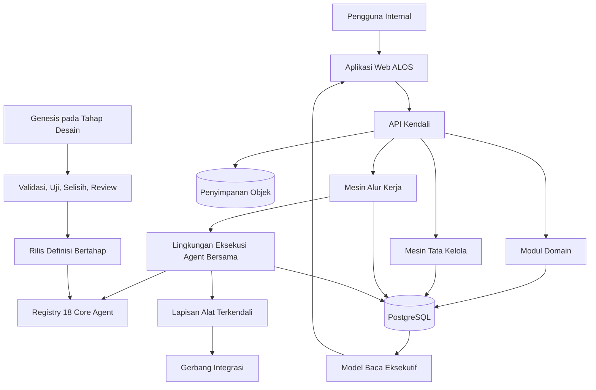

# Rencana Implementasi ALOS Internal v1

| Metadata | Nilai |
|---|---|
| Status | Rancangan untuk Pilot Internal |
| Versi dokumen | 0.1.0 |
| Target produk | ALOS Internal v1 |
| Tahap pelaksanaan | ALOS Internal Agent Pilot v0.1 |
| Pemilik | PT Andara Rejo Makmur |
| Pengelola teknis | Divisi IT |
| Pembaruan terakhir | 30 Agustus 2026 |
| Sumber utama | Dokumen Master Blueprint ALOS + GENESIS, 27 Agustus 2026 |

## Status Implementasi Saat Ini

| Area | Status | Bukti minimum |
|---|---|---|
| Foundation platform | Selesai | identitas lokal, project, work queue, migrasi, dan audit |
| Registry dan runtime | Fondasi Genesis G1–G2 | 18 Core tetap utuh; contract universal, Tool Registry, invocation workflow, runtime generik, digest, dan snapshot release immutable |
| Interface Genesis | Fondasi Genesis G3 | proposal REUSE/EXTEND/CREATE tervalidasi, diff deterministik, review manusia wajib, tanpa akses production |
| Governance bersama | Selesai untuk backend pilot | object storage lokal/S3-compatible, versioning, hash, evidence, approval, exception, CAPA, dan audit tersedia |
| FLOW-001 Sales | Selesai untuk backend pilot | Lead-to-Reservation lulus integration test PostgreSQL |
| FLOW-002 Finance | Selesai untuk backend pilot | Payment-to-Reconciliation lulus dengan SoD dan pembaruan budget |
| FLOW-003 Property | Selesai untuk backend pilot | review terpisah menghasilkan KPI atau exception dan CAPA |
| FLOW-004 Legal | Selesai untuk backend pilot | izin dan kontrak mencapai keputusan Legal Human terkontrol |
| FLOW-005 HR | Selesai untuk backend pilot | keputusan HR Human mengontrol pembuatan checklist personalia |
| FLOW-006 AI Executive | Selesai untuk backend pilot | snapshot bersumber menghasilkan brief dan decision queue untuk Direktur |
| Operational Query API | Selesai untuk backend pilot | list/detail, pagination, filter, sorting, dan isolasi organisasi/divisi/project |
| Identity & Access dasar | Selesai untuk backend pilot | direktori user, status, role assignment, project assignment, pencabutan, dan audit |
| Operasi kerja & governance | Selesai untuk backend pilot | inbox personal/divisi, claim, delegasi, deadline, reminder/escalation, approval claim, Exception dan CAPA terkontrol |
| Worker, outbox & integrasi | Selesai untuk backend pilot | scheduler deterministik, PostgreSQL outbox, lease/retry/dead-letter, notification internal, health, dan adaptor n8n bertanda tangan |
| Workspace web operasional | Phase 6A selesai | login pilot, sesi, navigasi berbasis role/divisi, konteks proyek, dashboard, antrean kerja, dokumen, risiko, dan observability memakai API nyata |

Status “selesai” di atas berarti siap untuk pengujian internal berbasis data sintetis,
bukan persetujuan penggunaan data perusahaan atau integrasi produksi.

Phase 6A menyediakan kerangka aplikasi dan jalur kerja harian tanpa menggantikan kontrol
backend. Form transaksi domain untuk enam workflow, layar keputusan approval, AI Executive,
administrasi identitas, dan pelaporan lengkap dilanjutkan pada Phase 6B–6C.

## 1. Tujuan

Dokumen ini menetapkan dasar implementasi ALOS Internal v1 dan ruang lingkup pilot agent internal selama dua minggu. Rencana ini menerjemahkan blueprint menjadi arsitektur, model domain, rancangan data, lingkungan eksekusi agent bersama, alur kerja, pengamanan, strategi pengujian, dan kriteria penerimaan yang dapat dilaksanakan.

Satu-satunya keputusan yang berstatus terkunci adalah struktur organisasi:

`DIREKTUR UTAMA -> AI EXECUTIVE OPERATING LAYER -> KEUANGAN, SALES & MARKETING, PROPERTY, HR, LEGAL, IT`

Seluruh ketentuan lain merupakan dasar desain atau implementasi yang wajib dapat dikonfigurasi, diberi versi, diuji, direview, dan disetujui sesuai kewenangannya.

## 2. Sasaran Produk

ALOS Internal v1 adalah satu aplikasi internal perusahaan yang menyediakan:

- autentikasi serta pengelolaan pengguna, peran, divisi, dan proyek;
- antrean kerja, penugasan, tenggat, pengingat, dan eskalasi;
- dokumen, bukti, persetujuan, penyimpangan, CAPA, dan jejak audit;
- KPI, dasbor, pelaporan, serta ringkasan AI Executive;
- Agent Registry dan satu lingkungan eksekusi bersama untuk 18 Core Agent logis;
- alur kerja dan kontrol tata kelola deterministik;
- alat dan integrasi eksternal yang dibatasi melalui kontrak;
- observabilitas serta proses rilis Genesis pada tahap desain.

Pilot harus menyelesaikan pekerjaan internal yang nyata, bukan sekadar menampilkan chatbot. Tindakan eksternal berisiko tinggi dapat tetap dilakukan manusia, sementara ALOS mencatat permintaan, bukti, keputusan, dan hasilnya.

## 3. Ruang Lingkup

### 3.1 Termasuk dalam pilot dua minggu

- satu aplikasi web dan satu backend modular;
- autentikasi lokal dengan batas antarmuka yang kompatibel OIDC;
- enam ruang kerja divisi dan satu tampilan AI Executive;
- konteks proyek dan kontrol akses berbasis peran;
- pekerjaan, tenggat, pengingat, dokumen, bukti, persetujuan, penyimpangan, dan CAPA;
- validasi Agent Contract serta pendaftaran seluruh 18 Core Agent;
- lingkungan eksekusi agent bersama dengan masukan dan keluaran terstruktur;
- enam alur kerja awal;
- satu adaptor penyedia LLM yang tidak mengunci vendor;
- penggunaan data sintetis atau data yang telah disanitasi;
- audit, telemetri operasional, pengujian otomatis, dan deployment lokal yang dapat diulang.

### 3.2 Tidak termasuk dalam pilot

- transfer bank, pelaporan pajak, penandatanganan kontrak, keputusan ketenagakerjaan, atau persetujuan hukum secara otonom;
- integrasi produksi dengan bank, WhatsApp, CRM, Coretax, OSS, HRIS, atau tanda tangan elektronik;
- Kubernetes, microservice per agent, database per agent, atau database per divisi;
- Genesis yang menghasilkan kode dan siap mengubah produksi;
- rumus KPI, SLA, ambang persetujuan, retensi, atau vendor final yang belum disahkan;
- pemrosesan bebas terhadap data pribadi atau rahasia perusahaan melalui LLM cloud.

## 4. Prinsip Pelaksanaan

1. Kewenangan manusia tetap final untuk keputusan material keuangan, hukum, personalia, dan organisasi.
2. Tenggat, izin, transisi status, routing persetujuan, perhitungan, dan audit ditegakkan secara deterministik.
3. LLM hanya digunakan untuk ekstraksi, klasifikasi, ringkasan, perbandingan, rekomendasi, dan penyusunan bahasa.
4. Keluaran AI harus memiliki sumber, versi, status verifikasi, dan jalur koreksi manusia.
5. Delapan belas Core Agent adalah konfigurasi logis dalam satu lingkungan eksekusi bersama.
6. Pemilik bisnis tetap divisi terkait; IT bertindak sebagai pengelola teknis platform.
7. Tidak adanya respons tidak pernah dianggap sebagai persetujuan.
8. Tindakan yang berdampak ke produksi wajib melewati kebijakan dan persetujuan yang berlaku.
9. Genesis hanya mengusulkan definisi berversi dan tidak dapat mengubah produksi atau organisasi secara langsung.
10. Aturan perusahaan yang belum tersedia ditandai `TBD` dan dapat memblokir tindakan material yang bergantung padanya.

## 5. Arsitektur Sasaran

ALOS v1 menggunakan monorepo privat dan monolit modular. Backend dapat dijalankan sebagai proses API, worker, dan scheduler yang menggunakan kode domain serta satu PostgreSQL yang sama.

Rincian batas komponen terdapat pada `docs/architecture/ALOS_V1_ARCHITECTURE.md`.

## 6. Dasar Domain dan Data

| Skema logis | Tanggung jawab |
|---|---|
| `identity` | pengguna, peran, sesi, penugasan divisi dan proyek |
| `platform` | proyek, pekerjaan, tenggat, pengingat, dokumen, bukti |
| `governance` | kebijakan, persetujuan, RACI, penyimpangan, CAPA |
| `workflow` | definisi, instans, langkah, transisi, dan timer |
| `agents` | definisi, rilis, eksekusi, alat, dan evaluasi agent |
| `executive` | snapshot KPI, ringkasan, antrean keputusan, model baca laporan |
| `finance` | permintaan pembayaran, anggaran, invoice, rekonsiliasi, pemeriksaan pajak |
| `sales` | lead, interaksi, tindak lanjut, pipeline, reservasi, rancangan konten |
| `property` | paket kerja, bukti lapangan, progres, inspeksi, defect |
| `hr` | rekrutmen, kandidat, penyimpangan kehadiran, berkas personalia |
| `legal` | izin, kontrak, klausul, kewajiban, review hukum |
| `it` | insiden, kesehatan layanan, rilis, pemeriksaan backup dan pemulihan |
| `integration` | konektor, referensi eksternal, kotak masuk/keluar, webhook |
| `audit` | catatan audit hanya-tambah dan metadata integritas |

Setiap fakta harus memiliki pemilik resmi, sumber, status verifikasi, versi, klasifikasi, dan riwayat. Berkas disimpan di penyimpanan objek; database menyimpan metadata, hash, versi, dan relasinya.

## 7. Dasar Lingkungan Eksekusi Agent

Seluruh agent menggunakan satu kontrak dan siklus eksekusi:

`RECEIVED -> VALIDATING -> RUNNING -> NEEDS_REVIEW | PENDING_APPROVAL | COMPLETED | FAILED | BLOCKED`

Setiap definisi wajib memuat:

`contract_version, agent_id, name, agent_kind, parent_agent_id, parent_agent_version, extends, domain, purpose, human_owner, triggers, inputs, source_of_truth, capabilities, outputs, tools_allowed, approval_boundary, evidence_requirement, forbidden_actions, metrics, escalation, version, status`.

Lingkungan eksekusi bertanggung jawab atas validasi kontrak, otorisasi, pembatasan kemampuan dan alat, validasi keluaran terstruktur, pencatatan sumber, penyerahan review manusia, idempotensi, percobaan ulang, penghentian darurat, audit, dan telemetri.

Konfigurasi pemanggilan agent berada pada capability invocation di definisi workflow. Agent Runtime menyelesaikan agent, capability, dan tool melalui registry; service domain hanya memilih workflow, langkah, serta selector bisnis yang sah.

## 8. Alur Kerja Awal

| ID | Alur kerja | Hasil utama |
|---|---|---|
| FLOW-001 | Lead ke Reservasi | lead terkualifikasi, penanggung jawab, rencana tindak lanjut, status pipeline/reservasi |
| FLOW-002 | Permintaan Pembayaran | bukti terverifikasi, hasil anggaran, persetujuan sah, pembayaran manusia, rekonsiliasi |
| FLOW-003 | Bukti Lapangan | bukti terverifikasi, selisih progres, pembaruan KPI, penyimpangan/CAPA |
| FLOW-004 | Izin dan Kontrak | data izin/kontrak terstruktur dan paket review Legal |
| FLOW-005 | Rekrutmen | permintaan sah, tugas review kandidat, daftar periksa onboarding dan berkas |
| FLOW-006 | Ringkasan Eksekutif | ringkasan berbasis data sistem dan antrean keputusan Direktur Utama |

FLOW-002 menjadi irisan vertikal acuan karena menguji dokumen, bukti, anggaran, persetujuan, pemisahan tugas, tindakan manusia, rekonsiliasi, penyimpangan, dan audit dalam satu alur.

## 9. Keamanan dan Kebijakan Data Awal

- akses ditolak secara bawaan dan diberikan seminimal mungkin;
- satu identitas manusia dapat memiliki beberapa peran yang diaktifkan secara eksplisit;
- RBAC dipadukan dengan konteks divisi, proyek, tujuan penggunaan, dan pemisahan tugas berbasis identitas;
- tindakan material dicatat pada audit hanya-tambah;
- rahasia disimpan di luar kode dan tidak terlihat langsung oleh agent;
- dokumen dan bukti memiliki hash, versi, klasifikasi, dan pemeriksaan akses;
- pilot hanya menggunakan data sintetis atau data yang telah disanitasi;
- data pribadi, payroll, kredensial bank, dan dokumen hukum mentah tidak dikirim ke LLM cloud tanpa kebijakan yang disahkan;
- penghentian darurat tersedia per agent, alur kerja, alat, dan integrasi.

## 10. Strategi Pengujian

Pengujian minimum mencakup:

- unit untuk fungsi deterministik;
- domain untuk invariant dan siklus status;
- tata kelola untuk izin, persetujuan, bukti, dan pemisahan tugas;
- alur kerja untuk transisi, timer, percobaan ulang, dan penyimpangan;
- kontrak untuk definisi agent, keluaran, alat, dan integrasi;
- regresi agent menggunakan data sintetis;
- keamanan untuk akses ilegal, unggahan, dan batas prompt injection;
- ujung-ke-ujung untuk enam alur kerja;
- skenario negatif untuk bukti kurang, persetujuan sendiri, data kedaluwarsa, duplikasi, dan penulisan tanpa izin.

## 11. Rencana Dua Minggu

| Hari | Fokus | Kondisi keluar |
|---|---|---|
| 1 | dokumentasi dan fondasi repository | rencana, arsitektur, kontrak, dan kerangka lokal siap |
| 2 | identitas, organisasi, proyek, migrasi | pengguna tercakup oleh peran, divisi, dan proyek |
| 3 | antrean kerja, dokumen, bukti, audit | pekerjaan dan bukti dapat ditelusuri |
| 4 | tata kelola dan alur kerja | transisi, persetujuan, SoD, dan penyimpangan berjalan deterministik |
| 5 | Agent Registry dan lingkungan eksekusi | 18 definisi valid terdaftar dan dapat dijalankan |
| 6 | kemampuan acuan FLOW-002 | permintaan pembayaran mencapai tindakan manusia dan rekonsiliasi |
| 7 | kemampuan Sales, Legal, Property, dan HR | lima alur domain dapat dijalankan |
| 8 | KDA, CRA, MCA, dan ringkasan eksekutif | ringkasan berasal dari catatan alur kerja |
| 9 | antarmuka ruang kerja, pengujian negatif, observabilitas | peran dapat bekerja dan kegagalan dapat ditelusuri |
| 10 | stabilisasi, UAT, deployment, handover | pilot dapat dijalankan ulang dan lolos penerimaan |

## 12. Risiko dan Pengendalian

| Risiko | Pengendalian |
|---|---|
| Ruang lingkup terlalu besar | kedalaman agent bertingkat dan kemampuan bersama diprioritaskan |
| Aturan perusahaan belum tersedia | tandai `TBD`; blokir tindakan material yang bergantung padanya |
| Kebocoran data sensitif | data sintetis/sanitasi dan kebijakan data AI eksplisit |
| Keluaran AI tidak konsisten | skema keluaran, sumber, data regresi, dan review manusia |
| Ketergantungan tersembunyi | batas modul, kontrak perintah/kejadian, dan uji arsitektur |
| Penguncian vendor terlalu dini | kontrak integrasi netral vendor |
| Audit tidak lengkap | korelasi menyeluruh dan audit hanya-tambah |

## 13. Definisi Selesai Pilot

Pilot dinyatakan selesai apabila:

1. enam ruang kerja divisi dan tampilan AI Executive dapat diakses sesuai kewenangan;
2. seluruh 18 Core Agent terdaftar dengan kontrak lengkap dan valid;
3. setiap Core Agent menyelesaikan setidaknya satu kasus penggunaan pilot;
4. enam alur kerja mencapai status akhir menggunakan data sintetis/sanitasi;
5. persetujuan, bukti, audit, penyimpangan, dan CAPA aktif;
6. aturan deterministik tidak bergantung pada LLM;
7. MCA menyusun ringkasan dari catatan sistem, bukan teks dasbor yang disiapkan manual;
8. pengujian otomatis dan negatif lulus;
9. deployment lokal dapat diulang melalui prosedur terdokumentasi;
10. keterbatasan dan keputusan manajemen yang belum tersedia dicatat terbuka.

## 14. Keputusan yang Masih Terbuka

- penyedia identitas final;
- penyedia dan pola deployment LLM yang disetujui;
- ambang persetujuan dan delegasi;
- rumus KPI dan nilai SLA;
- jadwal retensi dan pemilik klasifikasi data;
- hosting produksi, RTO, RPO, dan target ketersediaan;
- vendor sistem eksternal serta akses API produksi;
- format laporan dan perwakilan bisnis untuk UAT.

Nilai tersebut berstatus `TBD` dan tidak boleh diisi melalui asumsi implementasi.
