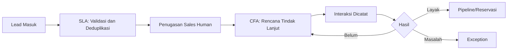
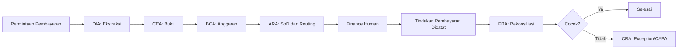
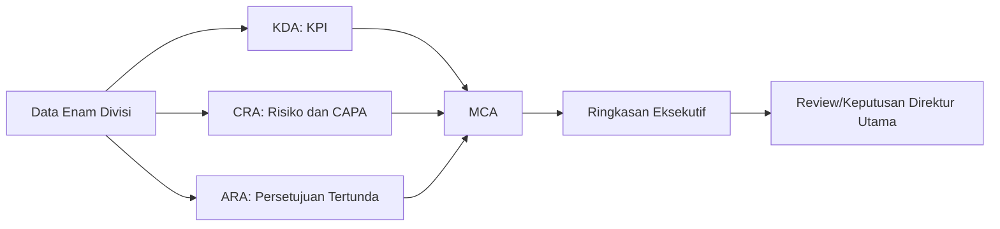

# Spesifikasi Alur Kerja ALOS Internal v1

| Metadata | Nilai |
|---|---|
| Status | Dasar Implementasi Pilot |
| Versi | 0.1.0 |
| Jumlah alur awal | 6 |
| Pembaruan terakhir | 28 Agustus 2026 |

## 1. Tujuan

Dokumen ini menetapkan perilaku enam alur kerja pilot. Setiap alur memiliki pemicu, aktor, status, aturan deterministik, penggunaan agent, bukti, persetujuan, jalur penyimpangan, dan kondisi selesai.

## 2. Standar Alur Kerja

Setiap eksekusi menyimpan `workflow_id`, versi definisi, organisasi, proyek, pemohon, peran aktif, status, langkah berjalan, tenggat, bukti, persetujuan, penyimpangan, eksekusi agent, dan ID korelasi.

Siklus umum:

`DRAFT -> SUBMITTED -> IN_PROGRESS -> NEEDS_REVIEW -> PENDING_APPROVAL -> ACTION_REQUIRED -> COMPLETED`

Jalur alternatif: `BLOCKED`, `EXCEPTION_OPEN`, `CANCELLED`, atau `FAILED`. Transisi ditetapkan oleh state machine. LLM tidak dapat memilih transisi, menentukan izin, menghitung angka, atau menutup audit.

## 3. FLOW-001 — Lead ke Reservasi

**Tujuan:** memastikan lead tercatat, tidak duplikat, memiliki penanggung jawab, ditindaklanjuti, dan mencapai status pipeline atau reservasi yang sah.

- **Pemicu:** formulir internal atau impor data sintetis.
- **Agent:** SLA dan CFA; MCA_MKT hanya jika diperlukan rancangan materi.
- **Aturan deterministik:** bidang wajib, deduplikasi, penugasan, consent, SLA, dan status pipeline.
- **Penggunaan AI:** klasifikasi kebutuhan, ringkasan interaksi, rekomendasi tindak lanjut, dan rancangan bahasa.
- **Bukti:** sumber lead, identitas minimum, consent, dan catatan interaksi.
- **Selesai:** lead berstatus tidak layak dengan alasan, masuk pipeline, atau menghasilkan reservasi yang direview manusia.
- **Penyimpangan:** lead tanpa pemilik, tindak lanjut lewat SLA, duplikasi tidak terselesaikan, atau komunikasi tanpa consent.

## 4. FLOW-002 — Permintaan Pembayaran

**Tujuan:** memastikan permintaan pembayaran memiliki dokumen, bukti, anggaran, persetujuan, tindakan manusia, dan rekonsiliasi yang dapat diaudit.

- **Pemicu:** formulir dan unggahan invoice.
- **Agent:** DIA, CEA, BCA, ARA, FRA; TIA jika pemeriksaan pajak diperlukan; CRA saat ada penyimpangan.
- **Aturan deterministik:** nilai uang, sisa anggaran, identitas pemohon/penyetuju, transisi, duplikasi, dan pencocokan.
- **Penggunaan AI:** ekstraksi invoice serta klasifikasi dokumen; hasil wajib direview jika keyakinan rendah atau data bertentangan.
- **Bukti:** invoice, referensi anggaran/RAB, dokumen progres atau penerimaan, keputusan persetujuan, dan bukti tindakan pembayaran.
- **Persetujuan:** mengikuti kebijakan rilis; nilai ambang produksi masih `TBD`. Pemohon dilarang menyetujui sendiri.
- **Selesai:** transaksi cocok dan seluruh audit lengkap, atau kasus ditutup resmi setelah CAPA.
- **Penyimpangan:** bukti kurang, anggaran tidak cukup, persetujuan tidak sah, duplikasi, pembayaran tidak cocok, atau SLA terlewati.

## 5. FLOW-003 — Bukti Lapangan

**Tujuan:** memverifikasi bukti progres, membandingkan klaim dengan hasil terverifikasi, memperbarui KPI, dan menindaklanjuti selisih.

- **Pemicu:** unggahan foto, pengukuran, opname, atau inspeksi.
- **Agent:** CEA, TPA, KDA, dan CRA.
- **Aturan deterministik:** proyek dan paket kerja wajib, format metadata, perhitungan progres/variance, batas waktu, dan status.
- **Penggunaan AI:** klasifikasi foto/dokumen dan ringkasan temuan; AI tidak menentukan persentase final tanpa data pengukuran yang sah.
- **Bukti:** berkas asli, hash, waktu, lokasi bila diwajibkan, pengukuran, dan identitas pemeriksa.
- **Selesai:** progres terverifikasi dan KPI diperbarui; variance di atas kebijakan menghasilkan Exception/CAPA.
- **Penyimpangan:** bukti tidak lengkap, metadata tidak sesuai, klaim duplikat, variance, defect material, atau izin dependensi tidak valid.

## 6. FLOW-004 — Izin dan Kontrak

**Tujuan:** menghasilkan catatan izin atau kontrak terstruktur beserta paket review Legal yang lengkap.

- **Pemicu:** unggahan izin/kontrak atau permintaan review.
- **Agent:** DIA, LPA atau CLA, CEA, dan ARA bila persetujuan diperlukan.
- **Aturan deterministik:** versi dokumen, bidang wajib, masa berlaku, daftar klausul wajib, status review, dan ketergantungan proyek.
- **Penggunaan AI:** ekstraksi, ringkasan, dan perbandingan klausul. AI tidak memberi opini atau persetujuan hukum final.
- **Bukti:** dokumen sumber, hash, template pembanding, sumber status izin, dan keputusan Legal Human.
- **Selesai:** record terstruktur diterima Legal Human dan status review dicatat; tindakan lanjutan menjadi tugas terpisah.
- **Penyimpangan:** sumber izin tidak resmi, dokumen kedaluwarsa, klausul wajib hilang, versi bertentangan, atau proyek dipaksa lanjut saat terblokir.

## 7. FLOW-005 — Rekrutmen

**Tujuan:** menjalankan permintaan rekrutmen dari kebutuhan yang disetujui sampai hasil review kandidat dan kelengkapan berkas awal.

- **Pemicu:** Recruitment Request dari divisi.
- **Agent:** SEA, HRA, ARA, dan HPA.
- **Aturan deterministik:** kelengkapan permintaan, persetujuan kebutuhan, status kandidat, jadwal, akses data, dan daftar dokumen.
- **Penggunaan AI:** ekstraksi CV sanitasi, ringkasan pengalaman, dan pencocokan terhadap kriteria yang telah disahkan.
- **Bukti:** permintaan posisi, kriteria, review manusia, keputusan, dan dokumen sanitasi.
- **Selesai:** permintaan ditolak dengan alasan atau kandidat pilihan manusia memasuki onboarding dan daftar periksa HPA.
- **Penyimpangan:** akses tidak sah, kriteria berubah tanpa versi, keputusan otomatis oleh AI, dokumen wajib kurang, atau tenggat review terlewati.

## 8. FLOW-006 — Ringkasan Eksekutif

**Tujuan:** menyusun ringkasan kondisi perusahaan dari data sistem dan menempatkan keputusan yang membutuhkan Direktur Utama ke antrean resmi.

- **Pemicu:** jadwal atau permintaan pengguna berwenang.
- **Agent:** KDA, CRA, ARA, dan MCA.
- **Aturan deterministik:** periode, cakupan data, rumus KPI rilis, usia pekerjaan, dan penyusunan antrean keputusan.
- **Penggunaan AI:** pengelompokan, ringkasan, prioritas rekomendasi, dan penyusunan bahasa.
- **Bukti:** setiap klaim memiliki tautan ke KPI, pekerjaan, persetujuan, penyimpangan, CAPA, atau kesehatan sistem.
- **Selesai:** ringkasan tersimpan, direview, dan decision item ditindaklanjuti atau diberi pemilik/tenggat.
- **Penyimpangan:** data sumber tidak lengkap, KPI tanpa rumus rilis, klaim tanpa sumber, atau informasi terbatas tampil tanpa izin.

## 9. Pengingat dan Eskalasi

Scheduler membuat pengingat berdasarkan tenggat rilis. Setelah SLA terlewati, sistem membuat kejadian keterlambatan dan menerapkan matriks eskalasi. Backup approver hanya dapat digunakan jika delegasi memiliki cakupan, batas, dan masa berlaku yang sah.

## 10. Audit Minimum

Setiap langkah mencatat pemicu, aktor dan peran aktif, versi alur/agent/kebijakan, keadaan sebelum dan sesudah, bukti, keputusan, alasan, waktu, korelasi, percobaan ulang, serta hasil. Koreksi AI dicatat sebagai versi baru, bukan menimpa hasil lama.

## 11. Kriteria Penerimaan Bersama

Setiap alur wajib lolos skenario normal, bukti kurang, akses ilegal, tindakan duplikat, pemisahan tugas, data kedaluwarsa, kegagalan agent, proses dimulai ulang, dan keterlambatan. Alur belum diterima jika status dapat dilompati melalui API atau perubahan langsung database.
